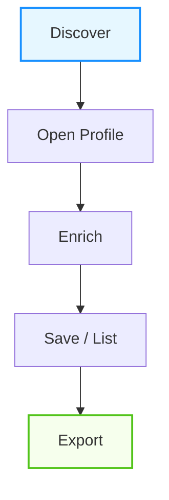
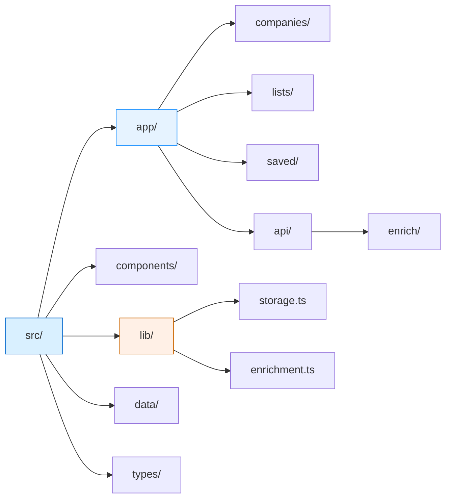

# vc_sourcing_mvp
MVP of a VC sourcing tool inspired by Harmonic.ai:VC Intelligence Interface + Live Enrichment a web app that lets users discover/mock-search companies, view profiles, and enrich them with real-time AI-scraped data from public websites.

core workflow:

# Minimum Features Required

This is the strict minimum feature set for a VC sourcing & triage web app MVP.  
Focus is on solving repetitive deal discovery → triage → save workflow fast, without bloat.

1. **App shell (sidebar + layout)**  
   Clean, responsive main layout with persistent sidebar navigation.  
   
2. **Companies search interface**  
   Prominent main search bar with instant/autocomplete results.  
   
3. **Filters + pagination**  
   Persistent sidebar filters:  
  
4. **Company profile page**  
   Dedicated page per company (route like `/companies/:id` or `/companies/:slug`).  
 
5. **Notes + save to list**  
   On profile page: add timestamped notes (markdown or rich text).  
  
6. **Saved searches**  
   Save current search query + active filters as a named preset.  
   Example: "US fintech seed 2025+".  
  
7. **Live enrichment (server-side)**  
   When viewing or searching, trigger background/on-demand data refresh from sources.  
   Show status per company/field: "Enriched 45 min ago" / "Enriching…" / "Failed – retry?".  
 
8. **Sources + timestamps**  
   Every displayed fact shows its source (badge/link): Crunchbase, LinkedIn, manual entry, X post, etc.  
 
9. **Deployable app**  
   Easy one-command or one-click deploy (Vercel, Railway, Render, Fly.io preferred).

# System Architecture 

- **Frontend:**
    - Next.js App Router
    - Tailwind UI
    - Client state + localStorage
 
- **Backend (inside Next.js):**
    - /api/enrich
    - Server-side scraping + LLM extraction
    - Environment variables (secure keys)

# MVP data layer:

| Layer              | Type         | Storage       |
|--------------------|--------------|---------------|
| Companies         | Mock JSON   | File         |
| Lists             | User state  | localStorage |
| Notes             | User state  | localStorage |
| Enrichment cache  | Optional    | localStorage |

# Folder Architecture:

      

